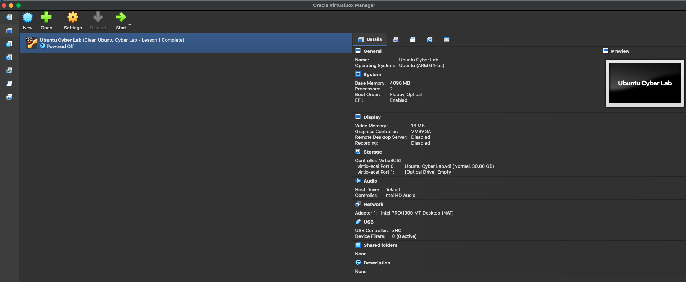
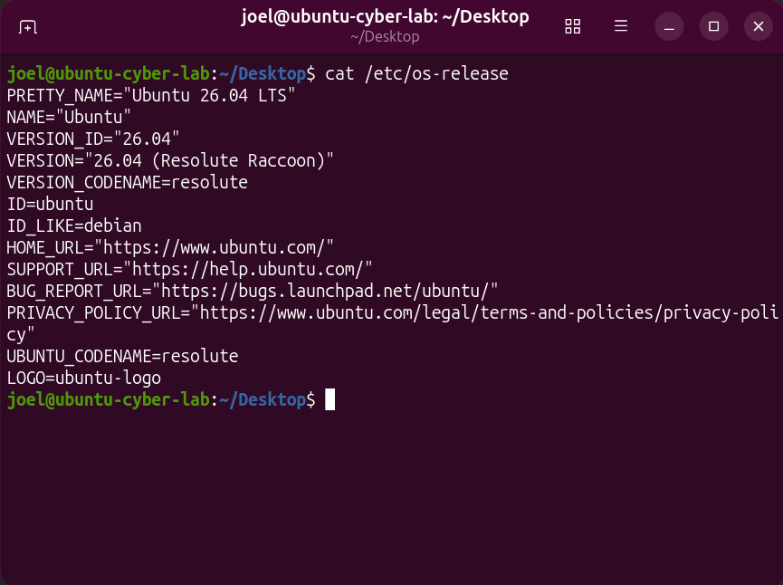

# Lab 01: Ubuntu Virtual Machine — Configuration Verification

## Objective

Inspect my existing Ubuntu virtual machine and verify its
operating system and processor architecture before beginning
additional cybersecurity exercises.

## Environment

| Component | Observed configuration |
| --- | --- |
| Virtualization software | Oracle VirtualBox |
| VM name | Ubuntu Cyber Lab |
| Operating system | Ubuntu 26.04 LTS |
| OS codename | Resolute Raccoon |
| Architecture | ARM 64-bit (aarch64) |
| Allocated memory | 4096 MB |
| Virtual processors | 2 |
| Virtual disk capacity | 30 GB |
| Network attachment | NAT |
| Shared folders | None configured |

## Verification Steps

1. Opened VirtualBox Manager and selected Ubuntu Cyber Lab.
2. Reviewed the VM configuration in the Details view.
3. Confirmed an existing snapshot named
   "Clean Ubuntu Cyber Lab - Lesson 1 Complete" was listed.
4. Started the VM and logged in to Ubuntu.
5. Opened Terminal and ran `cat /etc/os-release`.
6. Confirmed the output identified Ubuntu 26.04 LTS.
7. Ran `uname -m`.
8. Confirmed the output was `aarch64`.

## Commands and Their Purpose

| Command | Purpose |
| --- | --- |
| `cat /etc/os-release` | Display the installed Linux distribution and version |
| `uname -m` | Display the machine architecture reported by the kernel |

Both commands read system information without changing settings.

## Results

- The VM started successfully and allowed login.
- The installed operating system was verified from terminal output.
- The reported architecture matched the ARM 64-bit VM configuration.
- An existing snapshot was observed; restoration was not tested.
- Network connectivity was not tested in this exercise.

## Evidence

### VirtualBox Configuration

The VM has 4096 MB of memory, 2 virtual processors,
a 30 GB virtual disk, and NAT networking.

### Ubuntu Version

Terminal output confirms Ubuntu 26.04 LTS.

The command `uname -m` returned `aarch64`, confirming
ARM 64-bit architecture.

## Lessons Learned

Checking the actual operating system and architecture provides
an accurate starting point for choosing compatible software
and troubleshooting future problems.

A listed snapshot shows that a recovery point exists, but does
not prove that recovery has been tested.
