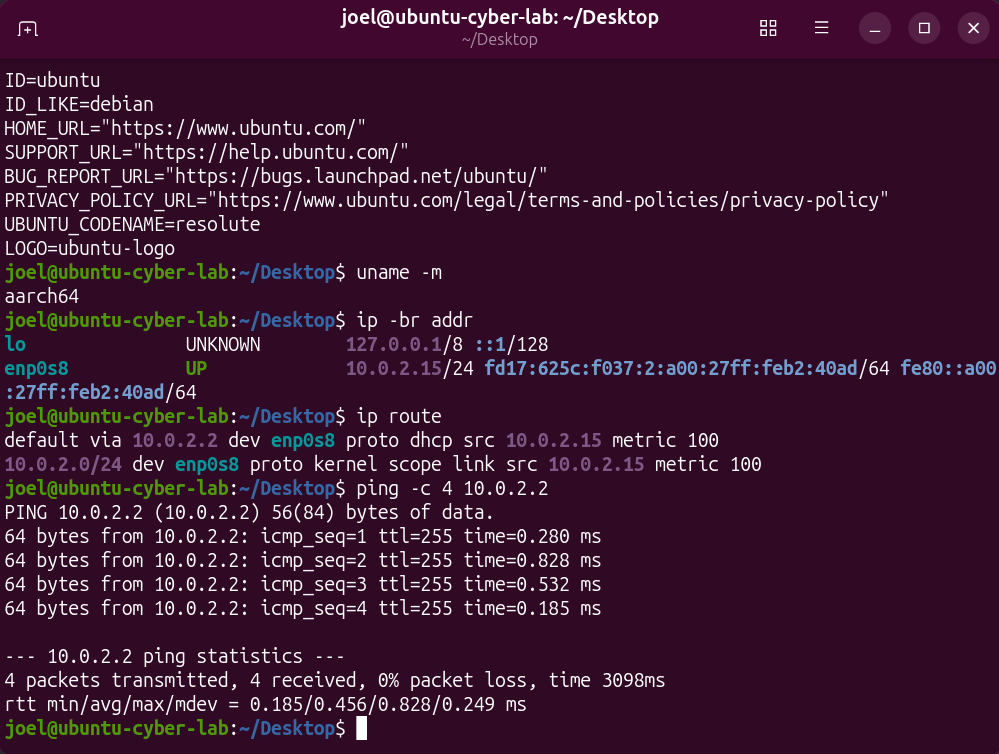
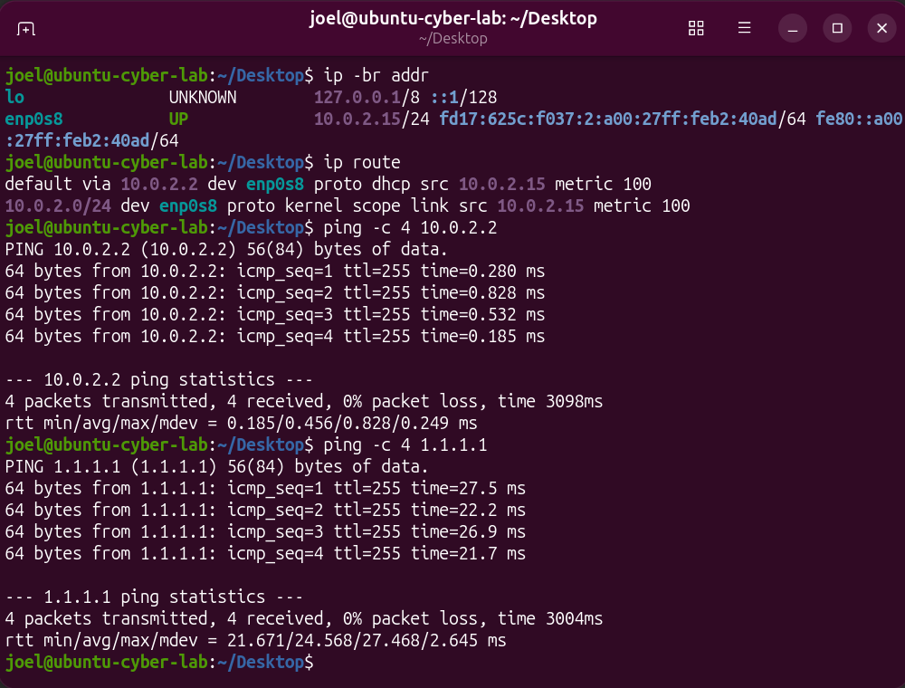
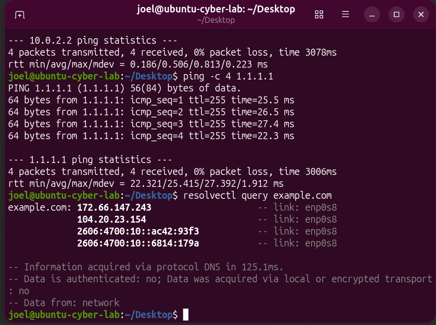
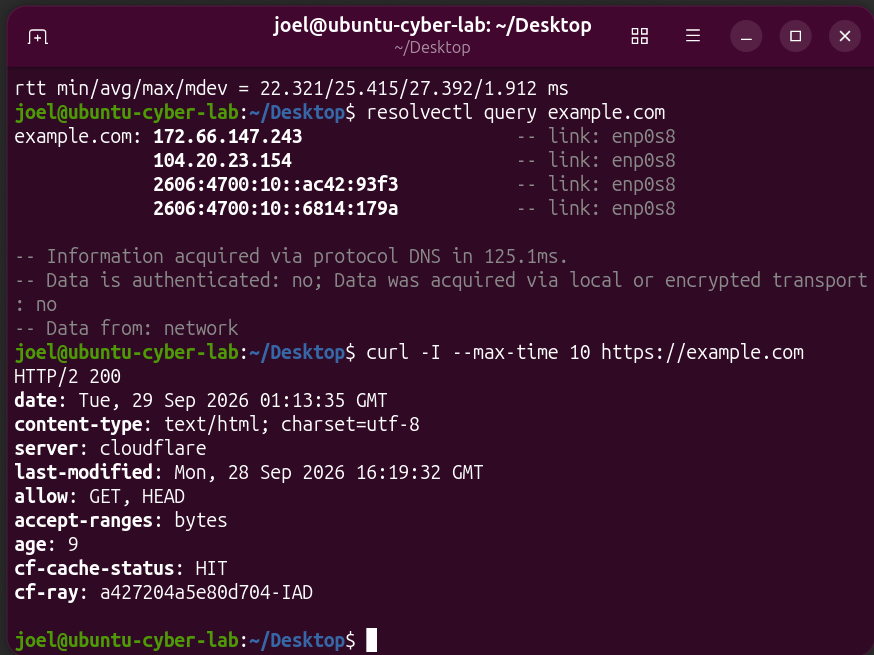

# Lab 02: Ubuntu Network Connectivity Verification

## Objective

Verify that my Ubuntu virtual machine has a network address, can reach its gateway and an external IP address, can resolve a domain name, and can connect to a website over HTTPS.

## Environment

- Ubuntu 26.04 LTS virtual machine in Oracle VirtualBox
- ARM 64-bit architecture (`aarch64`)
- VirtualBox network mode: NAT
- Active interface: `enp0s8`

## Troubleshooting Process

I checked each part of the connection in order: local address, route, gateway, external IP, DNS, and HTTPS. This helps identify where a failure occurs instead of changing network settings without evidence.

| Check | Command | Observed result |
| --- | --- | --- |
| Network address | `ip -br addr` | `enp0s8` was UP with IPv4 address `10.0.2.15/24`. |
| Default route | `ip route` | Default route used gateway `10.0.2.2` through `enp0s8`. |
| Gateway reachability | `ping -c 4 10.0.2.2` | 4 replies; 0% packet loss. |
| External IP reachability | `ping -c 4 1.1.1.1` | 4 replies; 0% packet loss. |
| DNS resolution | `resolvectl query example.com` | Returned IPv4 and IPv6 addresses. |
| HTTPS connection | `curl -I --max-time 10 https://example.com` | Received `HTTP/2 200`. |

## Evidence

### Address and route

### Gateway test

### External IP test

### DNS test

### HTTPS test

## Verification and Conclusion

The VM reached its NAT gateway and an external IP address, resolved `example.com`, and received a successful HTTPS response. Network connectivity worked at the time of testing. No network configuration changes were needed.

A failed ping by itself would not prove that a service is unavailable because some networks block ping traffic. Checking DNS and the actual HTTPS service gives more useful evidence.

## What I Learned

- An assigned IP address shows that an interface is configured, but does not alone prove internet access.
- The default route identifies where traffic leaves the local network.
- Testing an IP address separately from a domain name helps isolate DNS issues.
- An HTTPS response verifies the website connection more directly than pinging it.
