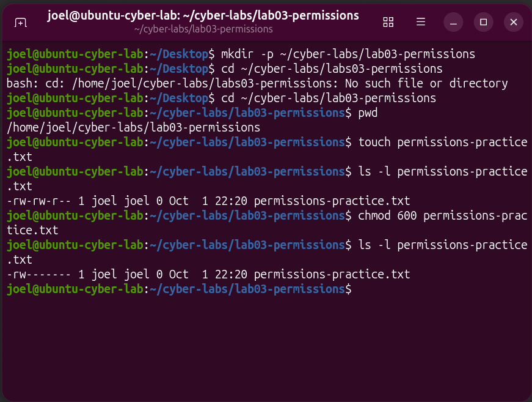
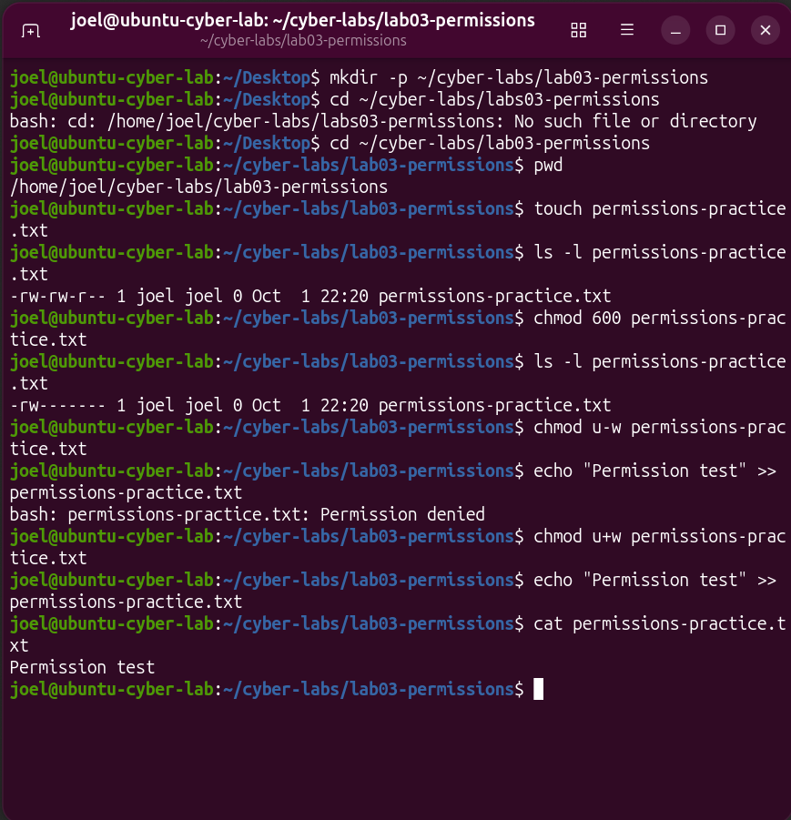

# Lab 03: Linux Users and File Permissions

## Objective
Identify my Ubuntu user account, interpret file permissions, and test how removing and restoring write permission affects access.

## Environment
- Ubuntu ARM virtual machine in VirtualBox
- Regular user account: joel
- Practice folder: ~/cyber-labs/lab03-permissions
- All permission changes applied to a practice file.

## Account and Ownership
I used `whoami` and `id` to identify my account and group memberships. My username was `joel`, with UID 1000 and primary GID 1000. My account belonged to the `sudo` group.

I used `ls -ld ~` to inspect my home folder. It was owned by `joel`, with permissions `drwxr-x---`.

## Procedure and Results
1. Created a practice folder with `mkdir -p`.
2. Entered the folder with `cd` and verified its location with `pwd`.
3. Created an empty file with `touch permissions-practice.txt`.
4. Inspected the file with `ls -l permissions-practice.txt`.
5. Applied `chmod 600 permissions-practice.txt` to allow owner read/write access and remove group and other permissions.
6. Removed owner write permission with `chmod u-w permissions-practice.txt`.
7. Attempted to append text and received `Permission denied`.
8. Restored owner write permission with `chmod u+w permissions-practice.txt`.
9. Repeated the write and verified the saved text with `cat`.

## Expected vs. Actual Results

| Test | Expected result | Actual result |
|---|---|---|
| Verify working folder | /home/joel/cyber-labs/lab03-permissions | Matched |
| Inspect initial file permissions | Identify ownership and current permissions | Owner/group: joel; permissions: -rw-rw-r-- |
| Apply chmod 600 | -rw------- | Matched |
| Write after removing owner write permission | Permission denied | Matched |
| Write after restoring owner write permission | Text saved successfully | cat displayed “Permission test” |

## Troubleshooting
My first `cd` attempt failed because I entered `labs03-permissions` instead of `lab03-permissions`. I compared the command with the folder name, corrected the extra letter, and verified the location using `pwd`.

## Understanding chmod 600
`chmod` changes file permissions. The three digits represent owner, group, and others.

Read has a value of 4, write has a value of 2, and execute has a value of 1. The owner digit 6 means read plus write (4 + 2). Each 0 grants no permissions to that category.

For this file, `600` produced `-rw-------`. This restricts ordinary access to the owner; it does not encrypt the file or prevent administrator access.

## Evidence

### File Permissions Before and After

### Permission Denied and Recovery

## My Reflection
This lab reminded me to proofread commands before pressing Enter. An extra letter or an unnecessary symbol can change the result. I encountered this when I typed the folder name incorrectly.

The `chmod 600` command was new and confusing to me. I wanted to understand its purpose and the meaning of the numbers. Working through the permission changes helped connect the command to the actual results.

## Skills Practiced
- Identifying Linux users and groups
- Navigating and verifying directories
- Reading file ownership and permissions
- Changing permissions with numeric and symbolic modes
- Testing a failure, correcting its cause, and verifying recovery
- Documenting results with screenshots
